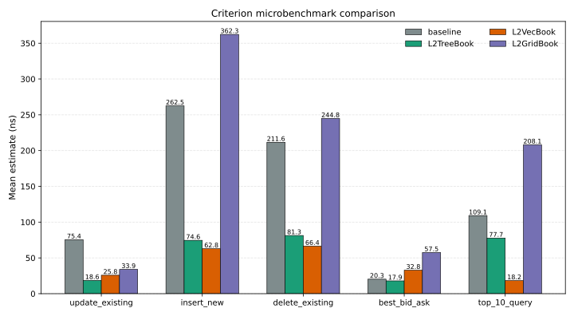
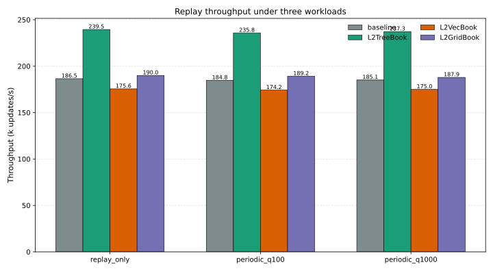
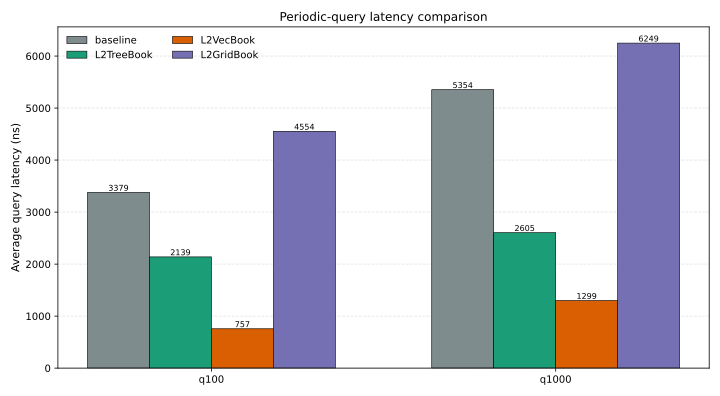
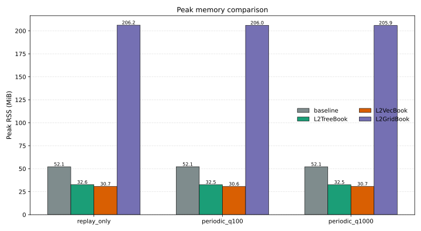

# 第五章 测试与结果分析

## 5.1 测试环境

### 5.1.1 硬件与软件环境

为保证不同订单簿实现之间的比较建立在统一实验平台之上，本文所有测试均在同一台 Linux 主机上完成。实验所使用的本地 L2 订单簿维护系统基于 `NautilusTrader` 框架实现，核心维护逻辑运行于 Rust 层，实验编排与结果整理由 Python 脚本完成。实验平台的主要软硬件环境如表 5-1 所示。

表 5-1 实验平台软硬件环境

| 项目 | 配置 |
| --- | --- |
| 操作系统 | Ubuntu 24.04.1，`Linux 6.14.0-1018-aws` |
| 处理器 | `Intel(R) Xeon(R) Platinum 8275CL CPU @ 3.00GHz` |
| CPU 核心数 | `8 vCPU` |
| 内存容量 | `15 GiB` |
| Python 版本 | `Python 3.12.3` |
| Rust 版本 | `rustc 1.94.0` |
| 代码基础 | 基于 `NautilusTrader` 开源量化交易框架扩展实现 |

需要说明的是，本文的实验重点在于比较不同结构在统一条件下的相对表现，而非测量某一特定硬件平台上的绝对性能极限。因此，本节给出平台信息的主要目的在于保证实验过程具有可复现性和可追溯性。

### 5.1.2 数据集与工作负载配置

本章采用统一的真实 L2 增量数据集作为输入，并在相同数据规模、相同重复次数和相同工作负载配置下，对 baseline、`L2TreeBook`、`L2VecBook` 和 `L2GridBook` 四种实现进行比较。第五章所引用的最终结果来自 `all_books_subset_10m_r3_q100_q1000_final_2026-04-10` 目录，其主要实验配置如表 5-2 所示。

表 5-2 实验数据与工作负载配置

| 项目 | 配置 |
| --- | --- |
| 数据集 | `binance-futures_incremental_book_L2_2024-12-10_BTCUSDT.csv.gz` |
| 交易对象 | Binance Futures `BTCUSDT` |
| 回放规模 | `10,000,000` 条 L2 增量 |
| 重复次数 | 每组实验重复 `3` 次，结果取平均值 |
| 比较对象 | `baseline`、`l2tree`、`l2vec`、`l2grid` |
| 工作负载 1 | `replay_only` |
| 工作负载 2 | `replay_periodic_query(q=100)` |
| 工作负载 3 | `replay_periodic_query(q=1000)` |
| 查询内容 | `best bid/ask` 与深度校验值 `query_depth_checksum` |
| 微基准测试案例 | `update_existing_level`、`insert_new_level`、`delete_existing_level`、`best_bid_ask`、`top_10_query` |

其中，`replay_periodic_query(q=100)` 表示系统每处理 100 条增量执行一次统一查询，`replay_periodic_query(q=1000)` 表示系统每处理 1000 条增量执行一次统一查询。通过设置两种不同的查询间隔，本文能够同时观察高频查询与相对稀疏查询两类场景下各结构的性能表现。

### 5.1.3 评价指标

本章主要从四个方面对系统进行评估。第一，正确性指标，用于验证不同候选结构在统一输入下是否能够保持与 baseline 一致的外部簿面语义。第二，吞吐指标，即 replay runner 输出的 `updates/s`，用于衡量系统在真实增量流下的整体维护能力。第三，查询指标，即周期查询场景下的平均查询延迟，用于刻画读写混合负载中的读取代价。第四，内存指标，即峰值 RSS，用于反映不同内部状态表示的空间成本。除此之外，本文还利用微基准测试对若干典型局部路径进行测量，以辅助解释真实回放实验中的整体表现。

## 5.2 测试设计、测试结果与结果分析

### 5.2.1 正确性验证结果

在进行性能比较之前，本文首先要求所有候选结构通过与 baseline 的一致性验证。根据第四章所述实现方式，`L2TreeBook`、`L2VecBook` 和 `L2GridBook` 均通过统一接口导出外部 `price-size` 序列，并与 baseline 在 `best bid/ask`、`top-N levels`、`sequence`、`ts_last` 和 `update_count` 等关键状态上进行对照。换言之，本章后续给出的性能结果，均建立在外部簿面语义一致这一前提之上，而不是通过改变语义解释方式来换取局部性能收益。

因此，本节不再重复列出所有 correctness 断言，而是在确认 correctness 已经成立的基础上，重点分析不同结构在统一工作负载下的性能差异及其工程含义。

### 5.2.2 微基准测试结果分析

为观察不同结构在局部关键路径上的行为差异，本文首先对五类微基准测试场景进行比较。各方案的 Criterion 均值点估计如表 5-3 所示。

表 5-3 Criterion 微基准测试均值点估计

| 场景 | baseline/ns | L2TreeBook/ns | L2VecBook/ns | L2GridBook/ns |
| --- | ---: | ---: | ---: | ---: |
| `update_existing_level` | 75.434 | 18.572 | 25.796 | 33.903 |
| `insert_new_level` | 262.523 | 74.574 | 62.791 | 362.330 |
| `delete_existing_level` | 211.580 | 81.300 | 66.397 | 244.803 |
| `best_bid_ask` | 20.287 | 17.877 | 32.818 | 57.513 |
| `top_10_query` | 109.093 | 77.699 | 18.247 | 208.064 |

图 5-1 Criterion 微基准测试关键路径对比图

由表 5-3 和图 5-1 可见，四种结构在局部关键路径上的性能特征存在较为明显的差异。`L2TreeBook` 在 `update_existing_level` 和 `best_bid_ask` 两项测试中表现最好，说明其在最常见的价位更新与最优价读取路径上具有较好的效率。相较于 baseline，`L2TreeBook` 的 `update_existing_level` 从 `75.434 ns` 降低至 `18.572 ns`，表明其直接以价位聚合数量为核心状态表示后，确实有效压缩了通用订单语义所带来的附加开销。

`L2VecBook` 在 `insert_new_level`、`delete_existing_level` 和 `top_10_query` 三项测试中取得最优结果，尤其在 `top_10_query` 场景下仅为 `18.247 ns`，明显优于 baseline 的 `109.093 ns` 和 `L2TreeBook` 的 `77.699 ns`。这一结果说明，连续内存布局在前缀深度遍历和局部盘口扫描场景中具有显著优势，也验证了其面向连续深度读取场景进行设计的合理性。

与之相比，`L2GridBook` 在 `update_existing_level` 测试中虽然已经优于 baseline，但在 `insert_new_level`、`delete_existing_level`、`best_bid_ask` 和 `top_10_query` 等场景中仍未表现出明显优势。这说明 grid 结构的收益并非在所有局部路径上都能够自然体现，其性能表现更可能依赖特定的访问模式与数据分布条件。

需要指出的是，微基准测试反映的是局部路径特征，而非真实回放场景下的整体吞吐表现。因此，表 5-3 和图 5-1 的作用主要在于辅助解释不同结构的内部代价来源，而不能单独作为最终工程结论的依据。

### 5.2.3 真实回放吞吐结果分析

在真实 L2 增量回放场景下，四种实现的平均吞吐结果如表 5-4 所示。

表 5-4 真实回放工作负载平均吞吐

| 工作负载 | baseline/k updates/s | L2TreeBook/k updates/s | L2VecBook/k updates/s | L2GridBook/k updates/s |
| --- | ---: | ---: | ---: | ---: |
| `replay_only` | 186.54 | 239.50 | 175.55 | 190.03 |
| `replay_periodic_query(q=100)` | 184.81 | 235.82 | 174.23 | 189.19 |
| `replay_periodic_query(q=1000)` | 185.14 | 237.26 | 175.01 | 187.94 |

图 5-2 不同工作负载下的真实回放吞吐对比图

由表 5-4 和图 5-2 可知，`L2TreeBook` 在三类真实回放工作负载中均取得最高吞吐。在 `replay_only` 场景下，其平均吞吐达到 `239.50k updates/s`，相较 baseline 的 `186.54k updates/s` 提升约 `28.4%`。在加入周期查询之后，`L2TreeBook` 的吞吐仍保持在 `235k` 至 `237k updates/s` 区间，表明其不仅在更新路径上具有较高效率，在读写混合负载下也保持了较好的稳定性。

baseline 在三类工作负载中的吞吐均维持在 `185k updates/s` 左右，整体表现较为稳定，但仍低于 `L2TreeBook`。这一结果与第四章的实现分析相吻合，即 baseline 虽然已经具备较直接的价位查询路径，但其更新流程中仍保留了 `synthetic order_id`、`cache` 和 `BookLevel.orders` 等通用语义残留，因此在纯 `L2_MBP` 场景下仍存在较为明确的专门化空间。

`L2VecBook` 在真实回放吞吐上未能超过 `L2TreeBook`，其 `replay_only` 结果为 `175.55k updates/s`，略低于 baseline。这一现象说明，连续内存布局虽然在局部查询路径上具有明显优势，但在真实增量流下，中部插入与删除带来的元素搬移成本仍然会对整体维护速度产生影响。因此，从真实回放的结果来看，`L2VecBook` 更适合作为读取友好型结构，而不宜直接作为默认实时维护结构。

`L2GridBook` 在当前最终结果中达到 `190.03k updates/s`，略高于 baseline，但仍明显低于 `L2TreeBook`。这一结果表明，经过阶段性压缩与优化后，`L2GridBook` 在真实回放场景中并非完全无效，但其改善幅度仍不足以支撑其成为通用默认方案。

### 5.2.4 周期查询场景结果分析

为进一步比较不同结构在读写混合负载中的查询代价，本文分别统计了 `q=100` 与 `q=1000` 两种周期查询场景下的平均查询延迟，结果如表 5-5 所示。

表 5-5 周期查询场景平均查询延迟

| 工作负载 | baseline/ns | L2TreeBook/ns | L2VecBook/ns | L2GridBook/ns |
| --- | ---: | ---: | ---: | ---: |
| `replay_periodic_query(q=100)` | 3379 | 2139 | 757 | 4554 |
| `replay_periodic_query(q=1000)` | 5354 | 2605 | 1299 | 6249 |

图 5-3 周期查询场景平均查询延迟对比图

由表 5-5 和图 5-3 可见，`L2VecBook` 在查询路径上具有最明显的优势。在 `q=100` 场景下，其平均查询延迟为 `757 ns`，相较 baseline 的 `3379 ns` 降低约 `77.6%`；在 `q=1000` 场景下，其平均查询延迟为 `1299 ns`，相较 baseline 的 `5354 ns` 降低约 `75.7%`。这一结果与其连续内存布局和前缀遍历特征高度一致，说明该结构在局部盘口因子提取、top-k 深度扫描等读取型场景中具有较强潜力。

`L2TreeBook` 的查询表现同样优于 baseline。其在 `q=100` 和 `q=1000` 场景下的平均查询延迟分别为 `2139 ns` 和 `2605 ns`，相较 baseline 分别降低约 `36.7%` 和 `51.3%`。这说明 `L2TreeBook` 并非仅仅依靠较快的更新路径获得优势，而是在保持较高回放吞吐的同时，也具备较好的查询性能，因此能够体现较为均衡的综合特征。

相比之下，`L2GridBook` 在当前真实工作负载下的平均查询延迟均高于 baseline。这表明，在本文所采用的真实 sparse replay 配置下，grid 结构中的分页与位图机制尚未转化为稳定的查询收益，其潜在优势更可能出现在更高 density、更深查询或更强局部性的场景中。

综上，周期查询实验较为清楚地体现了 `L2TreeBook` 与 `L2VecBook` 的差异化定位：前者更适合作为默认实时维护结构，后者则更适合作为面向连续深度读取的专用结构。

### 5.2.5 内存占用结果分析

除吞吐与查询延迟之外，内存占用也是本地 L2 订单簿维护系统的重要工程指标。不同实现的平均峰值 RSS 如表 5-6 所示。

表 5-6 不同工作负载下的峰值 RSS

| 工作负载 | baseline/MiB | L2TreeBook/MiB | L2VecBook/MiB | L2GridBook/MiB |
| --- | ---: | ---: | ---: | ---: |
| `replay_only` | 52.09 | 32.60 | 30.66 | 206.18 |
| `replay_periodic_query(q=100)` | 52.09 | 32.53 | 30.64 | 205.97 |
| `replay_periodic_query(q=1000)` | 52.09 | 32.52 | 30.66 | 205.90 |

图 5-4 不同工作负载下的峰值 RSS 对比图

由表 5-6 和图 5-4 可以看出，`L2TreeBook` 与 `L2VecBook` 在内存占用方面均明显优于 baseline。以 `replay_only` 场景为例，`L2TreeBook` 的峰值 RSS 为 `32.60 MiB`，相较 baseline 的 `52.09 MiB` 下降约 `37.4%`；`L2VecBook` 的峰值 RSS 为 `30.66 MiB`，相较 baseline 下降约 `41.1%`。这一结果说明，只要能够压缩通用订单语义残留，不论采用树形价位聚合还是连续向量布局，都有可能在纯 `L2_MBP` 场景下获得较好的空间收益。

`L2GridBook` 的空间特征则与前两者形成明显对比。在三类工作负载中，其峰值 RSS 均维持在 `206 MiB` 左右，约为 baseline 的 `4` 倍。这一现象表明，当前 `L2GridBook` 的主要工程压力不仅来自查询路径，也来自分页结构本身带来的较高固定空间成本。即便其在真实回放吞吐上已经略高于 baseline，过高的空间代价仍然削弱了其作为默认实现的工程可接受性。

同时还可以观察到，四种结构在三类工作负载下的峰值 RSS 变化都较小。这说明当前周期查询负载本身并不会显著改变对象驻留规模，内存差异主要来源于底层状态表示方式，而非查询频率的变化。

### 5.2.6 综合讨论

综合微基准测试、真实回放吞吐、周期查询延迟和内存占用结果，可以得到以下几点结论。

第一，在本文所采用的真实实验配置下，`L2TreeBook` 表现出最好的综合性能。它在三类真实回放工作负载中均取得最高吞吐，同时查询延迟显著优于 baseline，峰值内存又与 `L2VecBook` 处于同一较低水平。因此，将 `L2TreeBook` 作为当前默认实时维护结构是较为合理的工程判断。

第二，`L2VecBook` 在查询密集型场景中具有明显优势。虽然其端到端回放吞吐仍低于 `L2TreeBook`，但其在 `top_10_query` 和周期查询延迟上的结果都表明，连续内存布局对于局部盘口扫描、连续深度读取以及若干因子计算场景具有较强适应性。因此，`L2VecBook` 更适合作为因子计算友好的专用结构，而非默认实时维护结构。

第三，`L2GridBook` 的性能优势具有较强条件性。当前结果显示，它在真实回放吞吐上已经略高于 baseline，但查询延迟和空间成本仍明显不及 `L2TreeBook`。因此，在本文当前实现阶段，更稳妥的结论并非将其视为失败方案，而是将其理解为一种仍需结合高 density、深查询等特定场景进一步验证的专项候选结构。

由此可见，本文实验结果所揭示的并不是“某一种结构在所有场景下都绝对最优”，而是不同结构与不同工作负载之间的匹配关系。围绕纯 `L2_MBP` 场景，`tree`、`vec` 和 `grid` 三类结构分别对应不同的工程目标：`tree` 更偏向默认实时维护，`vec` 更偏向连续读取与因子提取，`grid` 则更偏向特定条件下的专项探索。

## 5.3 本章小结

本章在统一实验环境下，对 baseline、`L2TreeBook`、`L2VecBook` 和 `L2GridBook` 四种实现进行了系统测试与结果分析。首先，本文给出了实验平台、数据集、工作负载配置和评价指标，明确了第五章的比较口径。随后，在 correctness 一致性已经成立的前提下，本文分别从微基准测试、真实回放吞吐、周期查询延迟和峰值 RSS 四个方面对四种实现进行了分析。

实验结果表明，在本文当前实验配置下，`L2TreeBook` 在真实回放场景中取得了最优的综合工程表现，适合作为默认实时维护结构；`L2VecBook` 在连续深度读取和周期查询场景中表现突出，更适合作为因子计算友好的专用结构；`L2GridBook` 则呈现出一定的条件性优势，但在当前实现阶段仍受到较高空间成本和查询代价的限制。与此同时，baseline 作为通用语义最完整的工程参考实现，为本文识别 L2 专门化收益提供了必要参照。

综上所述，第五章不仅给出了不同结构在统一框架下的测试结果，也进一步说明了本文工作的核心价值不在于宣称某一种结构对所有场景都最优，而在于构建了一套面向纯 `L2_MBP` 场景的可比实验框架，并据此识别出不同结构各自适配的工程边界。下一章将在此基础上对全文进行总结，并讨论后续可继续推进的研究方向。
