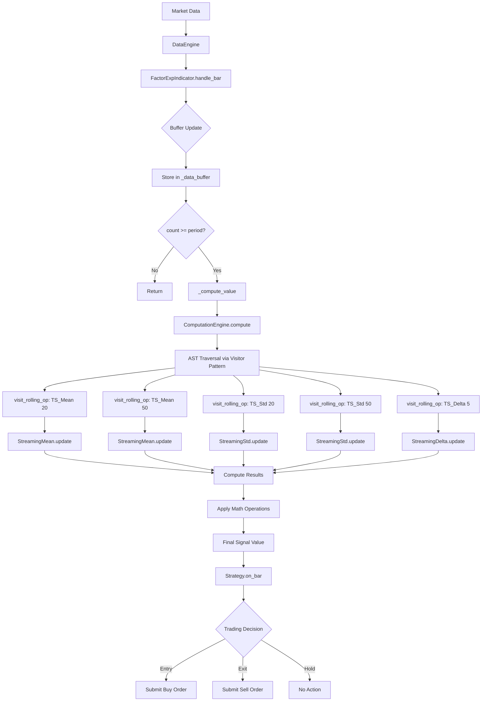

# FactorExp-Nautilus Integration: Complete Call Stack & Control Flow Analysis

## 1. Complex Factor Expression Analysis

### Expression Breakdown
```python
factor_expression = """
    (TS_Mean($close, 20) / TS_Mean($close, 50) - 1) * 100
    + Log(TS_Std($close, 20) / TS_Std($close, 50))
    * Sign(TS_Delta($close, 5))
"""
```

This expression combines:
- **Moving Average Ratio**: Fast MA(20) / Slow MA(50) as momentum indicator
- **Volatility Ratio**: Log of short-term vs long-term volatility
- **Direction Filter**: Sign of 5-period price change

### AST Structure
```
                    BinaryOp(Mul)
                   /              \
          BinaryOp(Add)         UnaryOp(Sign)
         /            \              |
  BinaryOp(Mul)    UnaryOp(Log)   RollingOp(TS_Delta)
      /      \          |              |
BinaryOp(Sub) 100  BinaryOp(Div)   Feature($close)
    |                /        \
BinaryOp(Div)   Rolling(Std,20) Rolling(Std,50)
   /      \
Roll(Mean,20) Roll(Mean,50)
```

## 2. Complete Call Stack Analysis

### Phase 1: Strategy Initialization
```
1. FactorExpMomentumStrategy.__init__()
   └─> Strategy.__init__()
       └─> Initialize strategy infrastructure

2. FactorExpMomentumStrategy.on_start()
   ├─> FactorExpIndicator.__init__(expression, period=50)
   │   ├─> ExpressionParser.__init__()
   │   ├─> ExpressionParser.parse(expression)
   │   │   ├─> _tokenize() → ["(", "TS_Mean", "(", "$close", ",", "20", ")", ...]
   │   │   ├─> _parse_expression() → _parse_additive()
   │   │   │   ├─> _parse_multiplicative()
   │   │   │   │   ├─> _parse_power()
   │   │   │   │   │   └─> _parse_unary()
   │   │   │   │   │       └─> _parse_primary()
   │   │   │   │   │           ├─> _parse_function_call("TS_Mean")
   │   │   │   │   │           │   └─> RollingOp("TS_Mean", Feature("close"), 20)
   │   │   │   │   │           └─> ... (recursively parse entire expression)
   │   │   │   │   └─> BinaryOp("Div", left, right)
   │   │   │   └─> BinaryOp("Add", left, right)
   │   │   └─> Return complete AST
   │   │
   │   ├─> ExpressionValidator.validate(ast)
   │   │   ├─> Check expression depth (max_depth check)
   │   │   ├─> Count operators (max_operators check)
   │   │   ├─> Validate features (allowed_features check)
   │   │   ├─> Check window sizes (max_window check)
   │   │   └─> Return ValidationResult
   │   │
   │   ├─> Extract metadata
   │   │   ├─> ast.get_features() → ["close"]
   │   │   ├─> ast.get_operators() → ["TS_Mean", "TS_Std", "TS_Delta", ...]
   │   │   └─> Determine max period → 50
   │   │
   │   ├─> ComputationEngine.__init__()
   │   │   ├─> Create unary operators map
   │   │   ├─> Create binary operators map
   │   │   └─> Initialize state
   │   │
   │   ├─> ExpressionCompiler.compile(ast)
   │   │   └─> Return CompiledExpression
   │   │
   │   └─> StreamingBridge setup
   │       └─> Register streaming computations
   │
   └─> strategy.register_indicator_for_bars(bar_type, indicator)
       └─> DataEngine registration
```

### Phase 2: Market Data Processing
```
3. Market Data Arrival
   └─> DataEngine.process_bar(bar)
       └─> DataEngine._handle_bar(bar)
           └─> For each registered indicator:
               └─> FactorExpIndicator.handle_bar(bar)

4. FactorExpIndicator.handle_bar(bar)
   ├─> Extract OHLCV data
   │   └─> data = {
   │       'open': 45000.0,
   │       'high': 45200.0,
   │       'low': 44800.0,
   │       'close': 45100.0,
   │       'volume': 125.5
   │   }
   │
   └─> _update_with_data(data, timestamp)
       ├─> Update buffers (current implementation)
       │   └─> For each feature in ["close"]:
       │       ├─> _data_buffer["close"].append(45100.0)
       │       └─> Maintain buffer size ≤ 50
       │
       ├─> Increment count
       │
       └─> If count >= period (50):
           └─> _compute_value(timestamp)
```

### Phase 3: Expression Evaluation
```
5. FactorExpIndicator._compute_value()
   └─> ComputationEngine.compute(expression, data, context)
       ├─> Set computation context
       │   └─> context.data = {"close": 45100.0}
       │
       └─> expression.accept(self) → Start visitor pattern
           │
           └─> [Root] BinaryOp("Mul").accept(engine)
               ├─> Left: BinaryOp("Add").accept(engine)
               │   │
               │   ├─> Left: BinaryOp("Mul").accept(engine)
               │   │   ├─> Left: BinaryOp("Sub").accept(engine)
               │   │   │   ├─> Left: BinaryOp("Div").accept(engine)
               │   │   │   │   │
               │   │   │   │   ├─> Left: RollingOp("TS_Mean", 20).accept(engine)
               │   │   │   │   │   └─> visit_rolling_op()
               │   │   │   │   │       ├─> Get/Create StreamingMean(20)
               │   │   │   │   │       ├─> Evaluate operand: Feature("close").accept()
               │   │   │   │   │       │   └─> visit_feature() → 45100.0
               │   │   │   │   │       ├─> computation.update(45100.0)
               │   │   │   │   │       │   └─> Update circular buffer & compute mean
               │   │   │   │   │       └─> Return: 45050.0 (example)
               │   │   │   │   │
               │   │   │   │   └─> Right: RollingOp("TS_Mean", 50).accept(engine)
               │   │   │   │       └─> Similar process → Return: 44900.0
               │   │   │   │
               │   │   │   └─> visit_binary_op("Div")
               │   │   │       └─> 45050.0 / 44900.0 = 1.00334
               │   │   │
               │   │   └─> Right: Constant(1).accept(engine)
               │   │       └─> visit_constant() → 1.0
               │   │
               │   └─> visit_binary_op("Sub")
               │       └─> 1.00334 - 1.0 = 0.00334
               │
               └─> Right: Constant(100).accept(engine)
                   └─> visit_constant() → 100.0
               │
               └─> visit_binary_op("Mul")
                   └─> 0.00334 * 100 = 0.334
               │
               [Continue similar pattern for the rest of the expression...]
               │
               └─> Final Result: 0.425 (example)
```

### Phase 4: Strategy Decision Making
```
6. FactorExpMomentumStrategy.on_bar() [continued]
   ├─> momentum_signal = indicator.value (0.425)
   ├─> Check entry conditions
   │   └─> If momentum_signal > 0.5 and sharpe_signal > 0:
   │       └─> _enter_long(bar)
   │           ├─> Create MarketOrder
   │           └─> submit_order(order)
   │               └─> ExecutionEngine.process(order)
   │
   └─> Log signals for monitoring
```

## 3. Control Flow Diagram



## 4. Data Flow Analysis

### Data Transformation Pipeline
1. **Raw Market Data**
   ```
   Bar(open=45000, high=45200, low=44800, close=45100, volume=125.5)
   ```

2. **Feature Extraction**
   ```python
   data = {'close': 45100.0, 'volume': 125.5}
   ```

3. **Buffer Management**
   ```python
   _data_buffer['close'] = [44900, 44950, ..., 45100]  # 50 values
   ```

4. **Streaming Computations**
   - StreamingMean(20): Maintains 20-value circular buffer
   - StreamingMean(50): Maintains 50-value circular buffer
   - StreamingStd(20): Maintains 20-value buffer + running stats
   - StreamingStd(50): Maintains 50-value buffer + running stats
   - StreamingDelta(5): Tracks current and 5-period-ago values

5. **Expression Evaluation**
   ```
   MA_ratio = 1.00334
   Vol_ratio = 0.95
   Direction = 1.0
   Signal = 0.334 + log(0.95) * 1.0 = 0.283
   ```

## 5. Performance Characteristics

### Time Complexity
- **Initialization**: O(n) where n = expression length
- **Per-update**: O(k) where k = number of operators
- **Memory**: O(w × f) where w = max window size, f = features

### Bottlenecks
1. **AST Traversal**: Recursive visitor pattern overhead
2. **Buffer Management**: Memory allocation/deallocation
3. **Repeated Computations**: Same features evaluated multiple times

### Optimization Opportunities
1. **Expression Compilation**: Pre-compute static parts
2. **Buffer Sharing**: Share buffers for same feature/window
3. **Lazy Evaluation**: Compute only when needed
4. **Vectorization**: Batch operations for multiple instruments

## 6. Key Architectural Insights

### Strengths
1. **Clean Separation**: Expression parsing, validation, and computation are well-separated
2. **Extensibility**: Easy to add new operators via visitor pattern
3. **Safety**: Multiple validation layers prevent dangerous operations
4. **Integration**: Seamless fit with Nautilus Trader's event system

### Current Limitations
1. **Uniform Buffers**: All features use the same buffer size (as identified)
2. **Single-threaded**: No parallel computation of sub-expressions
3. **Memory Overhead**: Duplicate buffers for same feature
4. **No Caching**: Recomputes entire expression each tick

### Recommended Improvements
1. **Smart Buffering**: Per-operator buffer management
2. **Expression Optimization**: Compile-time optimizations
3. **Parallel Evaluation**: For independent sub-expressions
4. **Result Caching**: For expensive operations

This analysis demonstrates how a complex factor expression flows through the entire system, from initial parsing to final signal generation, highlighting both the elegance of the design and opportunities for optimization.